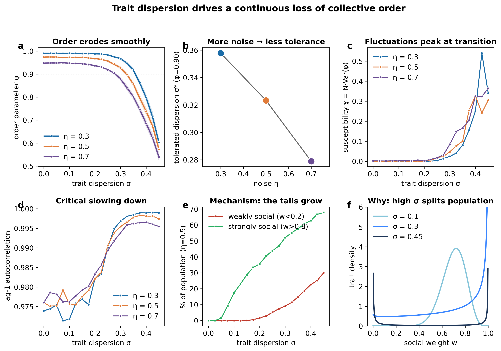

# Heterogeneity in social alignment drives a continuous loss of collective order

A Vicsek-type agent-based flocking model in which each individual carries its own
**social weight** `w` — how strongly it aligns to its neighbours. The population
mean is held fixed (`w̄ = 0.7`) while the **dispersion** `σ` of `w` across
individuals is increased. We measure how group-level order responds, across three
levels of movement noise.

The order parameter **φ** is the mean alignment of the flock: φ = 1 means every
individual moves in the same direction, φ ≈ 0 means directions are random.

## Main result

Increasing trait dispersion produces a **smooth, continuous decline** of φ — not a
sharp threshold. The dispersion a flock tolerates before order begins to break
down (φ falling to 0.90) shrinks as movement noise rises:

| noise η | tolerated dispersion σ* (φ = 0.90) |
|--------:|:----------------------------------:|
|   0.3   | ≈ 0.36 |
|   0.5   | ≈ 0.32 |
|   0.7   | ≈ 0.28 |

Approaching the loss of order, between-realization fluctuations (susceptibility)
grow and the temporal autocorrelation of φ rises toward 1 — a critical-slowing-
down signature. The mechanism is transparent: at fixed mean, raising σ develops
heavy tails in the social-weight distribution, so a growing minority of
individuals barely align (figure panels e–f).



## What is — and is not — claimed

- This is a **single system size (N = 200)** study. We report a continuous,
  finite-size decline of order and its noise dependence. We do **not** claim
  measured critical exponents or a thermodynamic critical point; that would need
  a controlled finite-size-scaling study, which this is not.
- The "dispersion" effect is partly the effect of a growing fraction of
  weakly-social individuals. We report this openly (tail fractions and the
  trait-distribution shapes) rather than attributing it to variance alone.
- The model is **simulation-only**. It is a scaffold, not fit to real trajectories.

## Requirements

- **Julia** with the environment pinned in `Project.toml` / `Manifest.toml`
  (activate with `--project=.`).
- **Python 3** with the packages in `requirements.txt`
  (`pip install -r requirements.txt`).

## Reproduce

```bash
# 1. canonical equilibrated sweep  (1,140 runs x 60k steps; ~45 min on many cores)
julia --project=. --threads=auto src/production_sweep.jl
# 2. equilibration / relaxation diagnostics (justify the run length)
julia --project=. --threads=auto src/diag_equilibration.jl
julia --project=. --threads=auto src/diag_relaxation.jl
# 3. analysis tables + figures
python3 src/analyze_production.py
python3 src/make_main_figure.py
```

## Design

- N = 200 agents in 2D; Vicsek-type alignment modulated per agent by a social
  weight `w in [0,1]` drawn from a Beta distribution with fixed mean 0.7 and
  standard deviation σ. Exact update rule: `src/heterogeneous_model_v2.jl`.
- Sweep: σ in {0.000, 0.025, ..., 0.450}; noise η in {0.3, 0.5, 0.7}; 20 seeds
  per condition.
- Run length: 60,000 steps, first 30,000 discarded as transient. Justified by
  `diag_relaxation.jl` (drift between the 3rd and 4th quarters of the run ≤ 0.01
  at every σ) and `diag_equilibration.jl` (short 500-step runs over-state φ near
  the transition by up to ~0.13).


Project.toml / Manifest.toml    pinned Julia environment
## Citing this work

See `CITATION.cff`. Author: Umar Aziz (ORCID 0009-0009-6266-4340).

## License

See `LICENSE`.
