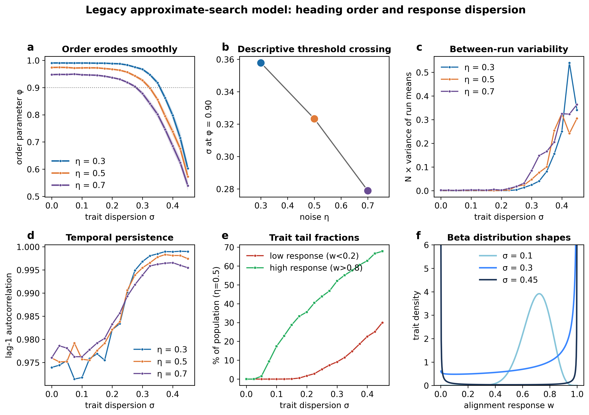

# Sheep collective ABM: heterogeneous alignment response

[](https://github.com/Umar2213/sheep-collective-abm/actions/workflows/checks.yml)
[](LICENSE)
[](https://julialang.org/)

Research software for studying how persistent individual differences can alter collective
heading dynamics in a sheep-inspired agent-based model. The code is deliberately
structured to separate **focal responsiveness**, **outgoing influence**, **directed social
ties**, **metric interaction range**, and **update convention**. It is not yet calibrated
or validated against measured sheep trajectories, so biological and novelty claims remain
hypotheses rather than established results.

See the [model specification](docs/MODEL.md), [simulation validation protocol](docs/EXPERIMENT_PROTOCOL.md),
[research plan](docs/RESEARCH_PLAN.md), [novelty matrix](docs/NOVELTY_MATRIX.md), and
[repository audit](docs/AUDIT.md).

## Current model architecture

For focal individual `i`, the model distinguishes three interaction components:

- `r_i`, persistent responsiveness, how strongly `i` changes its own direction in response to neighbours;
- `q_j`, outgoing influence, how strongly neighbour `j` contributes when used by others;
- `A_ij`, an optional directed dyadic tie, how strongly focal `i` weights neighbour `j`.

Neighbour contributions are normalized over currently available metric neighbours, then
blended with the focal individual's own heading. If no tie matrix is supplied and all
outgoing influence weights equal one, the model reduces exactly to the unweighted
heterogeneous-response baseline. This reduction is covered by automated tests.

Additional safeguards now include:

- exact periodic-radius neighbour search by default;
- both sequential and synchronous update modes as explicit scientific controls;
- independent random streams for traits, initial states and dynamical noise;
- crossed trait and dynamic realizations in corrected production and finite-size sweeps;
- per-run autocorrelation, effective-sample-size, block and window-drift diagnostics;
- matched exact-versus-approximate and sequential-versus-synchronous control experiments;
- deterministic condition-level sharding for distributed full runs;
- verified shard aggregation that rejects missing shards and duplicate replicate keys;
- one-step parameter-recovery utilities for focal responsiveness;
- an explicit structural test showing that unconstrained dyadic ties and outgoing influence are not separately identifiable under column rescaling;
- source, environment, seed-design and hash metadata for new simulation output.

`phi` is heading order only. It is not a spatial-cohesion, leadership, welfare or causal-
influence measure.

## Historical stored data

The repository preserves historical simulation tables so earlier results remain auditable.
Those tables were generated with the library's legacy approximate neighbour search and
must not be represented as output from the corrected exact-radius model.

There are 1,140 stored production replicates at N=200 and 1,520 stored finite-size
replicates across N=100, 200, 400, 800 and 1600. Their aggregate tables reproduce from the
stored replicate rows. The historical finite-size data do not establish a phase transition:
323 of 1,520 runs exceed the existing drift warning threshold, and most pooled fluctuation
maxima occur at the sampled boundary. See [AUDIT.md](docs/AUDIT.md) for the numerical audit.



## Software verification

The CI workflow installs Julia 1.10.5 and Python 3.12, runs Julia and Python tests, audits
stored tables, regenerates legacy figures, and executes smoke versions of the corrected
production, finite-size, algorithmic-control and distribution-control experiments.
CI merges actual two-shard Julia outputs for all four experiment families.

Run locally from the repository root:

```bash
python -m pip install -r requirements.txt
python -m unittest discover -s tests -v
julia --project=. -e 'using Pkg; Pkg.instantiate()'
julia --project=. tests/runtests.jl
ABM_SMOKE=1 julia --project=. --threads=2 src/production_sweep.jl
ABM_SMOKE=1 julia --project=. --threads=2 src/fss_sweep.jl
ABM_SMOKE=1 julia --project=. --threads=2 src/control_sweep.jl
ABM_SMOKE=1 julia --project=. --threads=2 src/distribution_control.jl
```

Smoke runs test software paths only. They provide no scientific evidence.

## Corrected full experiments

The validation protocol specifies four computational stages:

```bash
julia --project=. --threads=auto src/production_sweep.jl
julia --project=. --threads=auto src/fss_sweep.jl
julia --project=. --threads=auto src/control_sweep.jl
julia --project=. --threads=auto src/distribution_control.jl
```

The production sweep uses exact metric neighbours, N=200, three noise levels, 19
responsiveness-dispersion values, and a 5 by 4 crossed design of trait and dynamic
realizations. The finite-size experiment uses N=100 to 1600 at fixed density with a 4 by 4
crossed design. The matched control experiment reuses the same trait, initialization and
dynamical seeds across neighbour-search and update conventions.

Before launching the full grid, benchmark the actual machine that will run it:

```bash
ABM_BENCHMARK_N=200 ABM_BENCHMARK_STEPS=1000 julia --project=. src/benchmark_compute.jl
ABM_BENCHMARK_N=1600 ABM_BENCHMARK_STEPS=1000 julia --project=. src/benchmark_compute.jl
```

Full runs are computationally expensive. Each entry point can therefore be split over
multiple independent compute tasks. Sharding is by complete scientific conditions, so all
replicates for a condition stay together. For example, an eight-part production run can be
launched as separate tasks using:

```bash
ABM_SHARD_COUNT=8 ABM_SHARD_INDEX=1 julia --project=. --threads=auto src/production_sweep.jl
# repeat with ABM_SHARD_INDEX=2 through 8 on separate compute tasks
```

With the default output path this produces `shard_001_of_008` through
`shard_008_of_008`. After every shard finishes, merge only after integrity checks pass:

```bash
python src/merge_shards.py --experiment production --root results/exact_sequential_production
python src/merge_shards.py --experiment finite_size --root results/exact_sequential_fss
python src/merge_shards.py --experiment algorithmic_controls --root results/algorithmic_controls
python src/merge_shards.py --experiment distribution_controls --root results/distribution_controls
```

The merger rejects missing shards, inconsistent metadata, duplicate replicate keys and
incorrect total row counts, missing crossed-design keys, nonfinite values and stale heading
means before publishing a complete `merged/` dataset and `merge_report.json`. Run timestamps
and thread counts may differ across shards; scientific settings and source hashes must agree.
The report preserves every shard's metadata and hashes the merged CSVs. Existing output
directories are rejected; use a fresh `--output` path for a subsequent merge.
New outputs are kept separate from the historical tables and include `run_metadata.toml`
provenance information.

## Identifiability before biological interpretation

`src/identifiability.py` contains a small parameter-recovery layer for the one-step heading
rule. Tests verify that focal responsiveness can be recovered from informative synthetic
heading updates when the other components are known. They also verify a structural
non-identifiability in the unconstrained social-weight model: multiplying each column of
`A_ij` by a positive constant and dividing the corresponding `q_j` by the same constant
leaves every product `A_ij q_j` unchanged. Therefore outgoing influence must not be fitted
as a separate biological quantity unless independent constraints or recovery experiments
break that equivalence.

This negative result is scientifically useful. The model should be simplified when the
data cannot identify a parameter rather than reporting a precise but uninterpretable
estimate.

## Candidate research contribution

The broad claims that individual heterogeneity matters, that individuals can have distinct
interaction rules, that sheep can exhibit leadership, or that social interaction structure
affects collective motion are already established in the literature. They are therefore
not treated as the project's novelty.

The stronger candidate question is whether **individual responsiveness and independently
characterized partner-specific social relationships provide non-redundant, identifiable
and out-of-sample predictive information in sheep movement, under matched computational
controls and alternative movement kernels**. Outgoing influence is included only if its
identifiability can be demonstrated.

The planned hierarchy is:

| Model | Responsiveness | Dyadic ties | Outgoing influence |
|---|---|---|---|
| M0 | common | uniform | fixed 1 |
| M1 | individual | uniform | fixed 1 |
| M2 | common | measured/estimated | fixed 1 |
| M3 | individual | measured/estimated | fixed 1 |
| M4 | individual | measured/estimated | estimated only if identifiable |

A future empirical study should use complete held-out groups, days or movement bouts,
independently estimated social ties, parameter-recovery tests, proximity-only and
shuffled-network controls, and where data permit at least one alternative movement kernel
that does not assume explicit velocity alignment. See [NOVELTY_MATRIX.md](docs/NOVELTY_MATRIX.md)
for the evidence required before making a novelty claim.

## Held-out prediction evaluation

`src/prediction_evaluation.py` scores externally generated held-out predictions. It requires
identical observation coverage and observed headings across models, checks finite angles,
and reports each biological block separately. `compare_models` computes equal-block paired
MAE differences with a reproducible block-bootstrap interval. Negative differences favour
the alternative. It does not fit models or verify how their predictions were produced.
See [the prediction schema and example](docs/TRAJECTORY_DATA_SPEC.md#scoring-held-out-predictions).

The responsiveness fitter now profiles the bounded loss, refines candidate minima, checks
both endpoints and rejects flat loss. Profile ambiguity is a numerical warning, not a
confidence interval or proof of identifiability. See the
[2026-09-11 integrity review](docs/INTEGRITY_REVIEW_2026-09-11.md) for fixes and remaining gates.

## Citation and license

See `CITATION.cff` for software citation and `LICENSE` for the MIT license.
